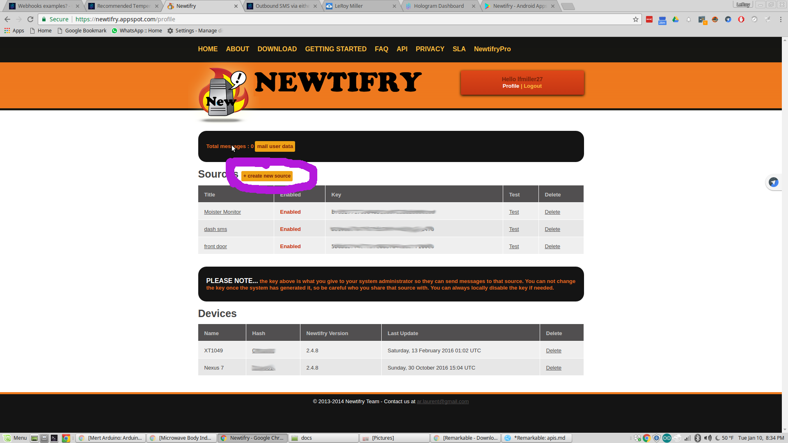
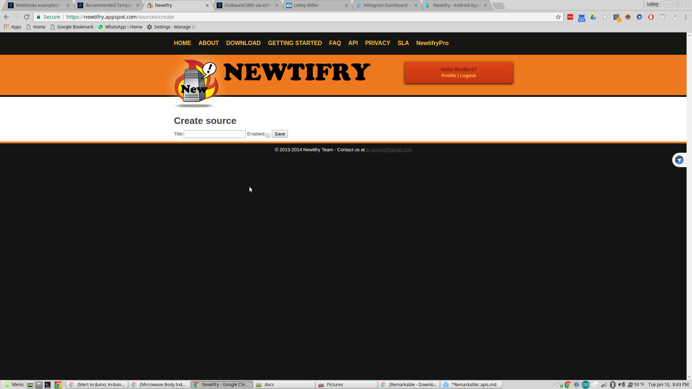
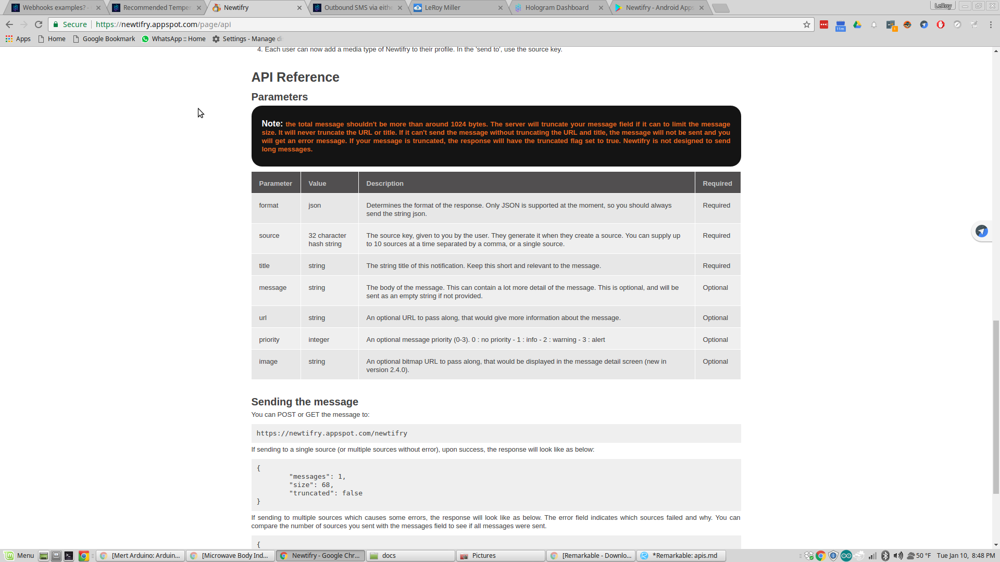
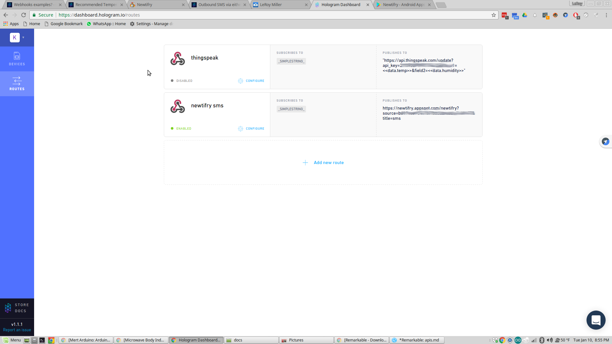
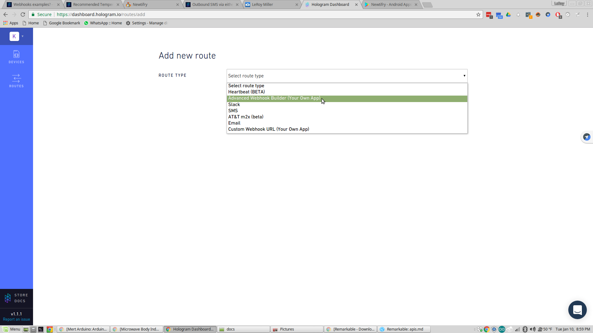
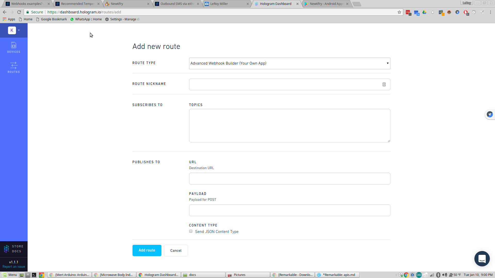
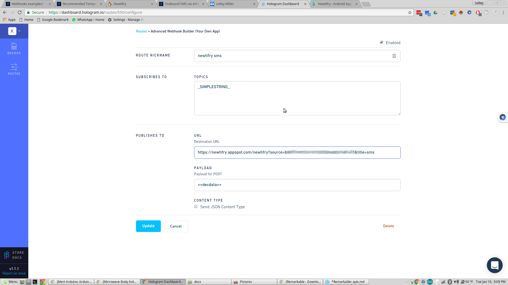

This step is kind of optional, but is part of my demo - with the hopes that it
will show how to setup the dash to work with various APIs.

I wanted something that would SMS me the temperature
Hologram does provide a SMS "webhook". When I first started testing, 
I didn't think it was working correctly. And I didn't like having to put my
phone number in the webhook - I thought I should beable to send a 
phone number from my device and have that trigger the "hook"

It didn't work that way, I didn't like it, and looked for another option.
From some of my other demos, and projects with ESP8266, and Arduino
I had used Newtifry successfully, I like how it works. And I understand
the Newtifry REST API - it's one of the easier APIs to use.
** That being said, I ran into a few problems with the dash and the webhook I setup. **

I found this thread ((https://community.hologram.io/t/webhooks-examples/225/3)) in the Community and after reading it a couple of times
the light bulb went off - and I had successfully send a message to Newtifry from the DASH.

 **The thing that I got from the docs, is that the message from the dash had to be sent in a json format.  Which is not correct at all**
 
 The message from the dash will append itself to the end of the url in
 the webhook, unless there is No payload, or unless json is selected.
 
 Ok, now that we have what I've learned out of the way, let's setup the
 Newtifry api for your device.
 
 You need an Android device for this (There are simular services for Apple and Windows devices, but that will go beyond the scope.  Setup should be very simular however).
 Install the Newtifry app on your device
 https://play.google.com/store/apps/details?id=com.newtifry.android
 
 Now head to https://newtifry.appspot.com/ and log in with your google
 account.
 
 You'll want to click on the "+create new source".
 
 
 You'll want to name your new source - This can be any name, but it's
 better to name it what it does or for the device you'll be using it with.
 I called mine "Dashsms".
 Click "enabled" and save.
 
 
 That should take you back to the 1st page, and you'll see your new source listed with a API key.
 
 You will want to either leave this page open, or copy and paste the 
 key in a text file for later use.
 
 If you click on API near the top of the page, you'll be shown the documenation for Newtifry and how to use the API.
 
 
 
 Here you see there are a couple of required parameters, and some optional parameters we can send to the api.
 
 Make note of the API url you'll need that a little later too.
 It's https://newtifry.appspot.com/newtifry
 
 Now you'll want to goto the hologram.io website, and login to your dashboard.
 
 On the left hand side of the dashboard you'll see "ROUTES" click on this,
 this is where we setup a "webhook". You're screen may look a little different, because I've already setup my hooks.
 
 
 Click on "+ Add a new route", the route type will be "Advanced Webhook Builder (Your Own App)"
 
 
 you should now see this screen:
 
 
 You will want to fill in the "Route nickname", again as far as I know this can be anything - I think it's best to keep it short, and call it for the service you'll be calling and maybe what that service does.
 "NewtifrySMS" for our demo. If you were to use thingspeak, it could be
 something like "Thingspeak Temperature".
 
 Next you'll put a topic in - From what I read/understand there are only a couple of topics but the one we want is "\_SIMPLESTRING\_" 
 
 The URL is going to be the Newtifry API url from above (or the Newtifry website).
 You will also add "?source=YOURKEY&title=sms" to the url. 
 Title can be anything you would like, keep it shortish will help. I used SMS because I want this to look more like a SMS, but it could be "Temperature Updates" or anything you like.
 see the picture below: 
 For payload you'll put <<decdata\>\> 
 
 
 
 Click "Add Route" and you'll be take back to the routes page.
 
 At this point you should have a DASH that can change the colors of the LED when it receives a color message, and a DASH that can send you the Temperature to your phone/tablet via Newtifry if you send it a message that says "temperature"
 
 Click on your Devices on the left hand side of the dashboard, and click on your device.
 Then click on "cloud and Messaging" and give it a try again.
 
 If something isn't working, check all the steps again, make sure your device is connected to hologram. And try again.
 
 Once you are happy with the results we will look at a custom website I made that can be used to send a message to the DASH.
 [Cloud9 Custom Site](customsite.md) 