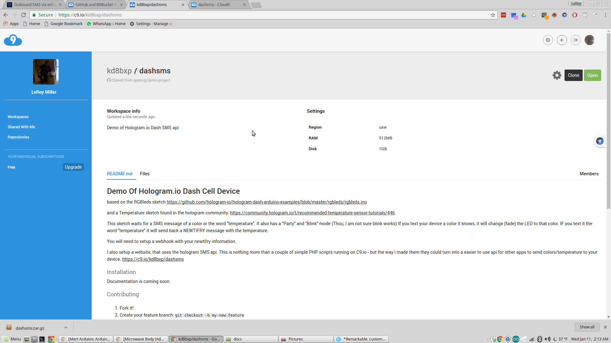
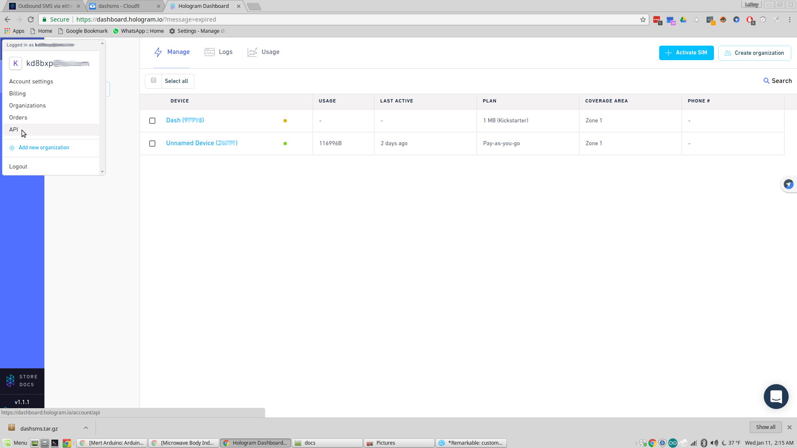
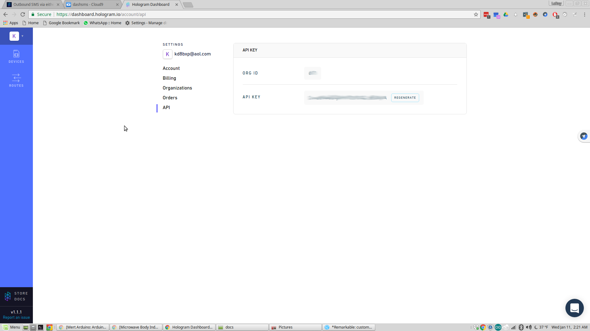
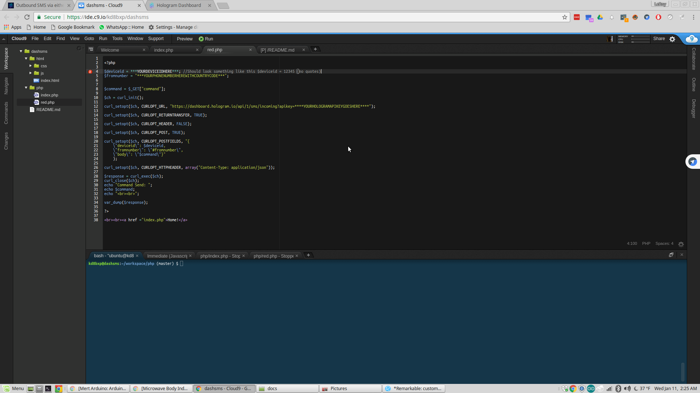
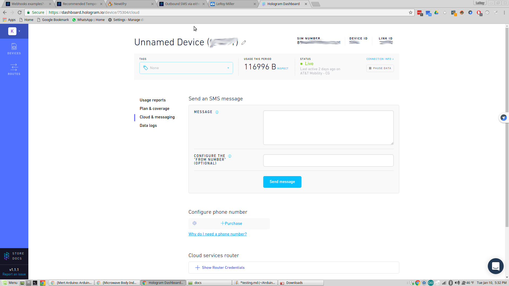
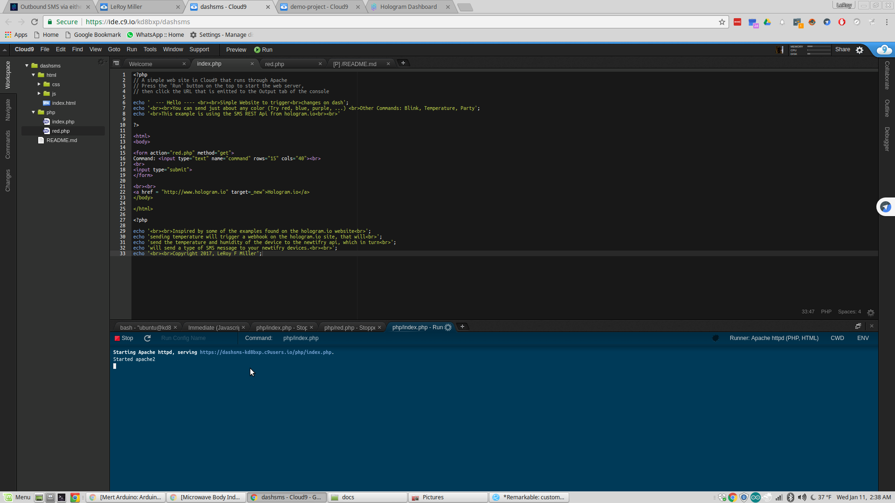
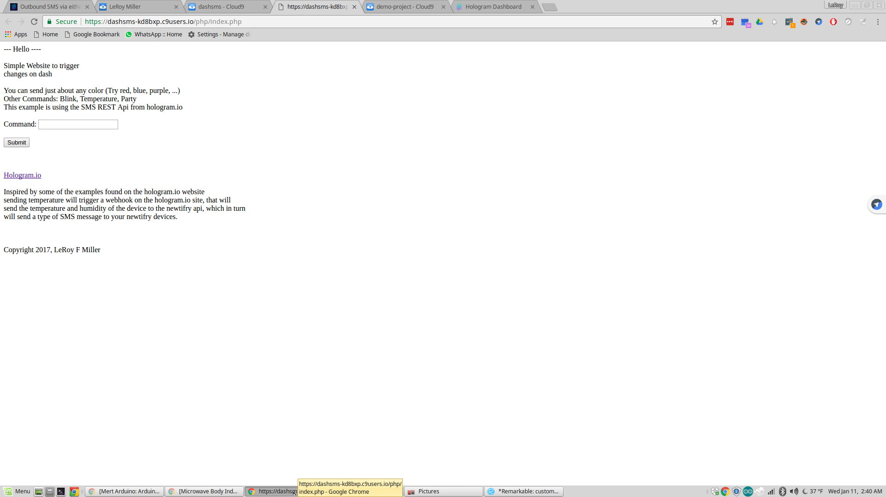
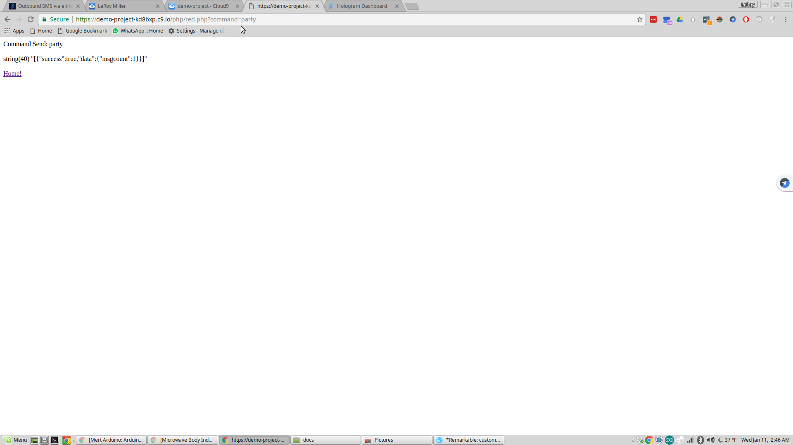

For more of what can be done using the Hologram.io REST API, and your
own website. I made a quick site, there are no style sheets or anything
else it's pretty basic. I have it running on C9.io cloud system.
And you can clone it and use it as well.

https://c9.io/kd8bxp/dashsms

Why C9? Well, since this is a demo, I don't need it to run all the time.
I can start the server as needed, do the demo.  C9 has both free and paid accounts. Free accounts do have some limits, but over all this works well for me.

You will need a C9 account to use this. Once logged into your account, you should see a "Clone" button in the upper right hand corner of the page.
Clone the workspace.

We need to go back to the Hologram.io Dashboard, in the upper left hand corner, you should see a "letter" ICON which will be the first letter of your login name.

Click on API, and you should see a screen simular to this one (Yours maybe a little different if you have never generated a API token)

If you don't have a API token, you'll need to click on generate. 
Once you have one, highlight and copy it.
You will need that for use with C9. In the dashsms C9 tab you should see a file called "red.php" this is where all the changes need to take place.

on line 12 you'll see "\*\*\*YourHOLOGRAMAPIKEYGOESHERE***"
replace that with the API token you just copied from Hologram.io

Next you'll need your deviceid from the hologram dashboard.
In the dashboard, click on "Devices", find the device you have the demo loaded on (if you have more than one device) and click on it.
The screen should look something like this (it maybe slightly different)

In the upper right hand corner you'll see "Device ID" - you want the number that is below that.
Copy it, and place it on line 4 of red.php on C9.io - 
Note: This is a number and should not be in quotes.

lastly, on line 5 of the file you'll want to replace what is inside the quotes
with your phone number - it should contain the plus sign and country code with area code (for the U.S. and Canada (I think)) this looks like this
+11235551212 

Finally we are ready to run the files - click on the "index.php" tab, and then just above that tab you'll see "Run" 
click run, and the process will start.
In the console view block, you should see that php/index.php is running and a clickable website should be showing in the windows.

Click that link and then click open a new tab in your browse should open up. And you'll see the demo site and instructions on how to use it.

Make sure your dash is on and connected to hologram.io and give the new site you just made a try. Type "red" or "green" or "temperature".
The results should be that the color of the LED changes or you get a "SMS" message with the temperature.
You should also see a "success" or "fail" message when you click submit.
*This is my DEMO site, with my API key and information, your URL will be different*

If you look at the URL thou, you can see that the form from index.php sends the word "command" with what ever you typed into the text box.
So I typed "party" and the URL looks like this:
https://demo...../php/red.php?command=party
So you may beable to see another possable use for this site would
be to make a Android or IOS app that interacts with just the "red.php" script.  I didn't have time to make one, it was on my list of things to
do and I ran out of time.

Next lets look at making some changes to the Arduino code to use Thingspeak. [Arduino Code Changes](changes.md) 
