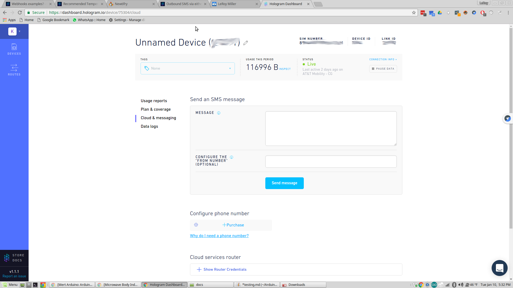
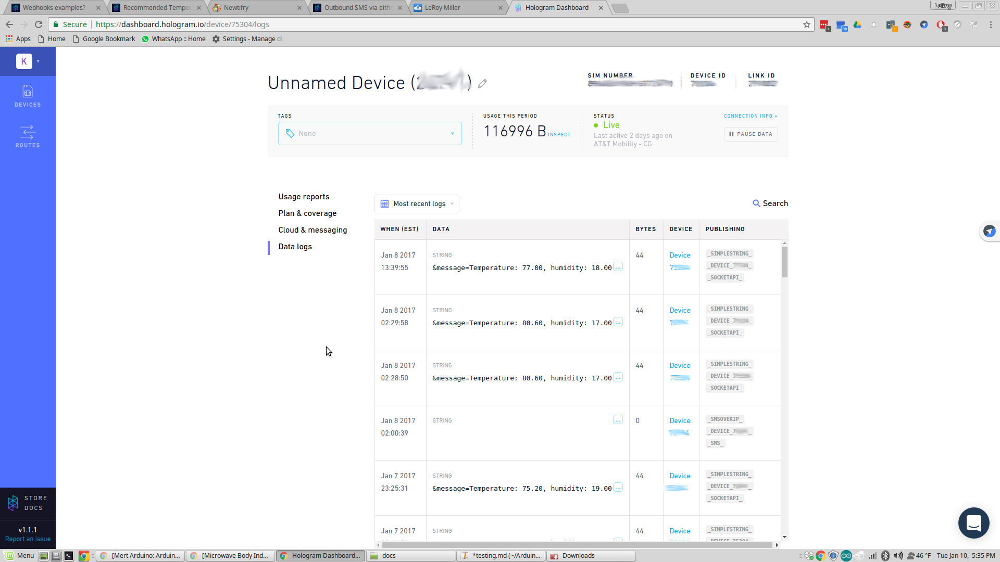

Again, I'm am assuming you have setup your Arduino IDE, and have successfully uploaded a sketch to the Dash.
https://github.com/hologram-io/hologram-dash-arduino-examples

Note: I had to run my Arduino IDE as admin to upload a sketch.

Make sure the sketch is loaded in the IDE, then you'll want to select Dash (or Dash pro) as your board. Hit the upload button, and upload the sketch.
When it's done, you'll want to goto your Hologram.io Dashboard, and select the
correct dash if you have more than one.

Click on Cloud & messaging, in the message block

 type a color "RED" "blue"
"purple" "green" and hit send message.
A couple of seconds later you should see the color on the RGB LED. If the color is wrong - you'll want to check your wiring.  If you never see the color or the color doesn't change, make sure your dash is connecting to the hologram.io gateway.

You can also type "temperature" here, and then click on data logs - a new message should show up telling you the temperature and humidity.
It should looks something like this:

IF you get all that, congradulations the sketch is working your wiring is hooked up right, and you can move on to [setting up the APIs.](apis.md) 

