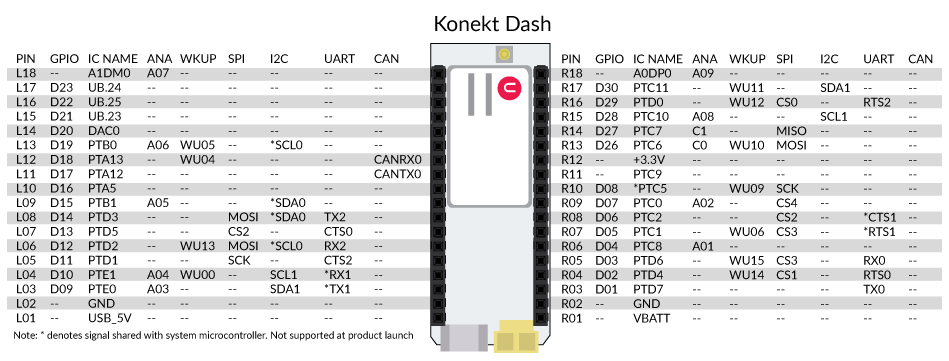
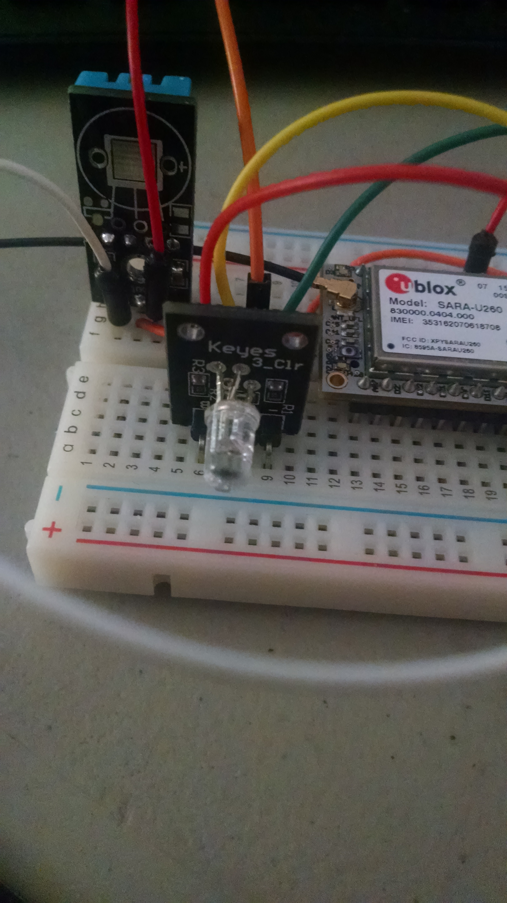
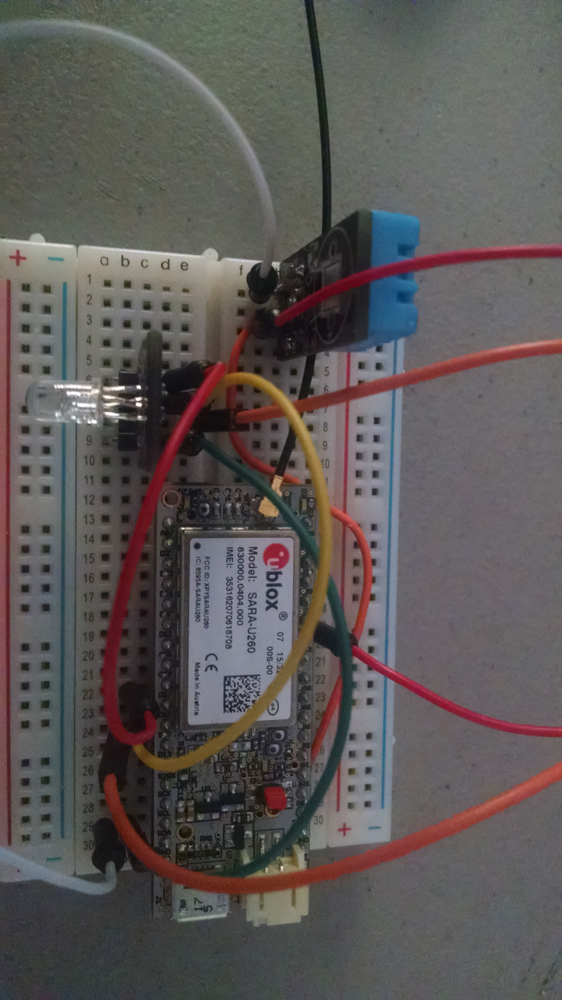
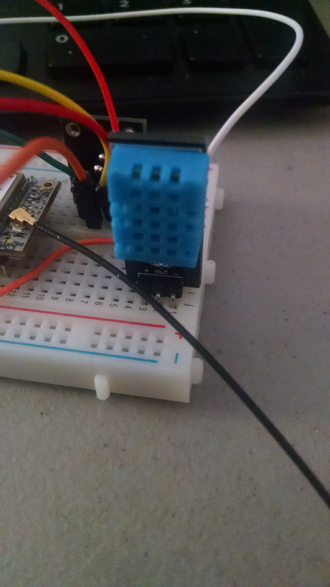
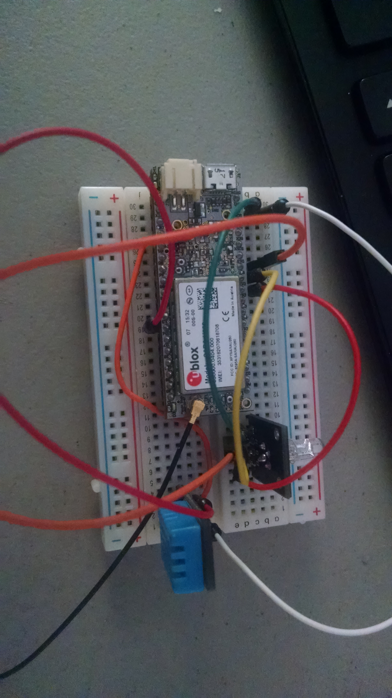

The dash has a couple of interesting features, one is the pins can be numbered by Pin number (D01, D02, D03, etc.) or by which side of the board they are on.
(R01, R02, L10, L08, ect) Most of the examples I've see use the Left/Right method.

using that method does appear to make it a little easier to hook up quick circuits.

For the RGB the cathode needs to be hooked to a GND (L02, R02)
The Red leg of the LED to L09, The Green to L08, and the Blue to L07 - if you are using a Keys RGB breakout board, check these connections before by connecting the cathod (-) to a GND, and each of the other pins to the 3.3v - what you are doing is checking to see that "R" is RED and "B" is Blue they were reversed on my breakout board (not a big deal if you know it ahead of time)

The DHT11 is just as easy to hookup with the + positive leg going to the 3.3v of the DASH (R12), - negitive going to GND (L02, R02) and the data line going to R04.

Again, I assume you have already activated your SIM, and connected your antenna, and generally your DASH is working with the Hologram.io Dashboard (you have already done the send a test message and seen it appear in the serial console)

 

Because it's now time to upload the demo sketch found here in the this repository. [Uploading and Testing](testing.md) 